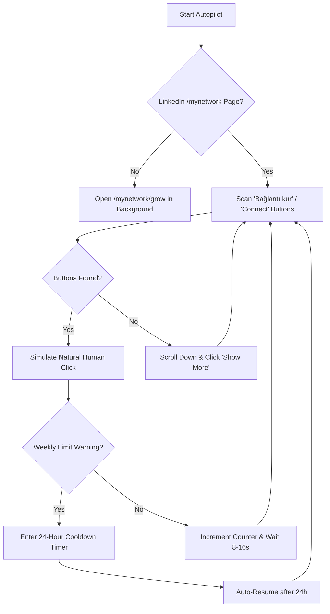

<div align="center">

# ⚡ LinkedIn Autopilot 24/7
### The 100% Free, Open-Source & Fully Autonomous LinkedIn™ Connection Growth Engine

[](https://github.com/DevKursat/linkedin-autopilot/stargazers)
[](https://github.com/DevKursat/linkedin-autopilot/network/members)
[](https://github.com/DevKursat/linkedin-autopilot)
[](https://opensource.org/licenses/MIT)
[](https://github.com/DevKursat/linkedin-autopilot/pulls)
[](https://github.com/DevKursat/linkedin-autopilot)

<p align="center">
  <b>Tired of paying $30–$80/month for Waalaxy, Dux-Soup, or Octopus CRM?</b><br>
  <b>LinkedIn Autopilot</b> is an ultra-lightweight, zero-cost Chrome extension that grows your network 24/7 on autopilot — featuring <b>1-click instant connects</b>, <b>infinite suggestion loading</b>, and an <b>intelligent 24-hour weekly limit recovery system</b>.
</p>

[Quick Start (1 Min)](#-quick-installation-1-minute) • [Feature Comparison](#-why-choose-linkedin-autopilot-vs-paid-tools) • [How It Works](#-how-it-works-architecture) • [Türkçe Kılavuz](#-t%C3%BCrk%C3%A7e-rehber) • [FAQ](#-frequently-asked-questions)

---

</div>

## 💡 Why Choose LinkedIn Autopilot? (vs. Paid Tools)

Most commercial LinkedIn automation tools charge hefty monthly subscriptions, store your session cookies on external third-party servers, and stop abruptly when weekly limits are encountered.

| Feature | 💸 Waalaxy / Dux-Soup / Octopus | ⚡ **LinkedIn Autopilot** |
|:---|:---:|:---:|
| **Monthly Cost** | **$30 – $80 / mo ($360+/yr)** | **$0 (100% Free & Open Source)** |
| **Privacy & Security** | Cookies sent to remote cloud servers | **100% Client-Side (Zero Server Storage)** |
| **Weekly Limit Handling** | Throws error / halts / requires manual reset | **Intelligent 24h Sleep & Auto-Resume Loop** |
| **Connection Flow** | Slow popup modals with note prompts | **1-Click Instant Connect via `/mynetwork`** |
| **Chrome Compatibility** | Many still use deprecated Manifest V2 | **Modern Chrome Manifest V3** |
| **Setup Complexity** | Mandatory account registration & trial cards | **30 Seconds (Download & Run)** |

---

## 🌟 Key Features

### ⚡ 1. Direct 1-Click Connects (Zero Dialog Popups)
Unlike standard search pages that trigger multi-step *"Add a note"* modals, LinkedIn Autopilot operates directly on LinkedIn's suggestion engine (`/mynetwork/grow/`), delivering instant single-click invitations at maximum reliability.

### 🔄 2. Infinite Feed Loading ("Show More" Auto-Trigger)
Never run out of profiles to connect with. When visible cards are processed, the extension automatically scrolls down and triggers the *"Show more"* button to fetch fresh batches of targeted profiles.

### ⏳ 3. Intelligent 24-Hour Weekly Limit Recovery Loop
When LinkedIn's weekly invitation quota is reached, the extension does not crash or stop permanently. Instead, it:
1. Catches the limit notification safely.
2. Automatically enters a **24-hour sleep mode** with a real-time countdown timer.
3. **Automatically wakes up and resumes** after 24 hours without requiring any human intervention.

### 🛡️ 4. Anti-Ban Human Pacing (Account Safety First)
Mimics natural human browsing behavior with randomized intervals (8–16 seconds) and complete mouse/pointer event sequences (`pointerdown` → `mousedown` → `click`) to preserve your LinkedIn Social Selling Index (SSI) and Trust Score.

### 🔒 5. 100% Privacy & Zero Data Collection
- ❌ No tracking or telemetry.
- ❌ No external API endpoints.
- ❌ No passwords, session cookies, or personal data ever leave your machine.

---

## 🚀 Quick Installation (1 Minute)

### Step 1: Clone or Download
Clone the repository or download the ZIP:

```bash
git clone https://github.com/DevKursat/linkedin-autopilot.git
```

*(Or click the green **Code** button at the top right → **Download ZIP**, then extract it).*

### Step 2: Load into Browser
1. Open your Chromium-based browser (**Google Chrome**, **Brave**, **Microsoft Edge**, or **Opera**).
2. Go to the extensions page:
   - Chrome: `chrome://extensions`
   - Brave: `brave://extensions`
   - Edge: `edge://extensions`
3. Toggle on **"Developer mode"** in the top right corner.
4. Click **"Load unpacked"** (Paketlenmemiş öğe yükle) in the top left.
5. Select the extracted `linkedin-autopilot` folder.

### Step 3: Run on Autopilot
1. Pin the **LinkedIn Autopilot** icon to your browser toolbar.
2. Click the extension icon and press **"🔗 LinkedIn Ağım Sayfasına Git (/mynetwork/grow)"**.
3. Click **"⚡ Otomasyonu Başlat"** (Start Automation).
4. Keep the tab open in the background — it will automatically run 24/7, load new profiles, and manage weekly quotas seamlessly!

---

## 🖥️ Sleek & Minimalist UI

<div align="center">

```
┌──────────────────────────────────────────────┐
│  ⚡ LinkedIn Autopilot 24/7     [7/24 Aktif] │
├──────────────────────────────────────────────┤
│  Toplam Gönderilen Bağlantı Daveti           │
│  ⭐ 142 kişi                                 │
│  ⚡ 7/24 Kesintisiz Mod                      │
├──────────────────────────────────────────────┤
│  [●] 7/24 Çalışıyor (Davetler gönderiliyor) │
├──────────────────────────────────────────────┤
│  [ ⚡ Otomasyonu Durdur ]                    │
│  [ 🔗 LinkedIn Ağım Sayfasına Git ]          │
├──────────────────────────────────────────────┤
│  Canlı İşlem Günlüğü              [Temizle]  │
│  • 20:14:02  ✅ Davet gönderildi: John Doe   │
│  • 20:14:18  ✅ Davet gönderildi: Sarah M.   │
└──────────────────────────────────────────────┘
```

</div>

---

## 🛠️ How It Works (Architecture)



---

## 🇹🇷 Türkçe Rehber

### LinkedIn Ağım 7/24 Kesintisiz Otomatik Davet Sistemi

- **Diyalogsuz & Hızlı Gönderim:** LinkedIn'in *Ağım (`/mynetwork/grow`)* sayfası üzerinden hiçbir onay kutusuyla uğraşmadan tek tıkla bağlantı daveti iletir.
- **Sonsuz Liste Yükleme:** Ekrandaki öneriler bittiğinde otomatik olarak *"Daha fazla yükle"* butonuna basarak yeni kişileri ekrana getirir.
- **24 Saatlik Akıllı Limit Kurtarma:** LinkedIn haftalık kota uyarısı verdiğinde sistem durmaz; 24 saatlik uyku moduna geçer ve **süre dolunca otomatik olarak kaldığı yerden devam eder**.
- **%100 Güvenli & Yerel:** Şifreniz veya çerezleriniz hiçbir harici sunucuya iletilmez, tüm işlemler tamamen kendi bilgisayarınızda çalışır.

---

## ❓ Frequently Asked Questions (FAQ)

<details>
<summary><b>1. Is this extension detectable by LinkedIn?</b></summary>
LinkedIn Autopilot implements natural human-like randomized delays (8–16 seconds) and full pointer/mouse event sequences rather than instant programmatic clicks. Operating within weekly limits protects your account health.
</details>

<details>
<summary><b>2. Do I need to keep my computer/browser on?</b></summary>
Yes. The extension runs client-side inside your browser. Simply leave the LinkedIn tab open in the background while you work or leave your computer running.
</details>

<details>
<summary><b>3. Why is it free when other tools charge $30+/month?</b></summary>
We believe networking tools should be accessible to everyone without paying expensive SaaS fees. This project is 100% open-source under the MIT license.
</details>

---

## 📈 Star History

If this tool helps you grow your network and saves you subscription money, please consider giving it a **Star (⭐)**!

[](https://star-history.com/#DevKursat/linkedin-autopilot&Date)

---

## 🤝 Contributing

Contributions, issues, and feature requests are welcome!
Feel free to check the [issues page](https://github.com/DevKursat/linkedin-autopilot/issues).

1. Fork the Project
2. Create your Feature Branch (`git checkout -b feature/AmazingFeature`)
3. Commit your Changes (`git commit -m 'feat: Add some AmazingFeature'`)
4. Push to the Branch (`git push origin feature/AmazingFeature`)
5. Open a Pull Request

---

## ⚠️ Disclaimer

This project is an independent open-source tool developed for educational, testing, and productivity purposes. It is not affiliated with, sponsored by, or endorsed by LinkedIn Corporation. Use responsibly in accordance with LinkedIn's Terms of Service.

---

## 📄 License

Distributed under the **MIT License**. See [`LICENSE`](LICENSE) for more information.

<div align="center">
  <b>Built with ❤️ by <a href="https://github.com/DevKursat">DevKursat</a></b>
</div>
